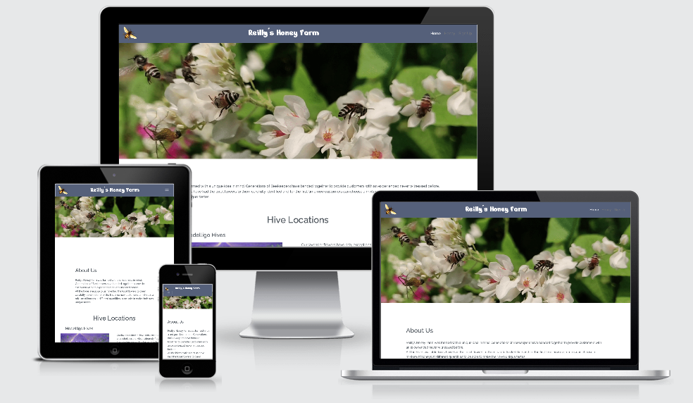
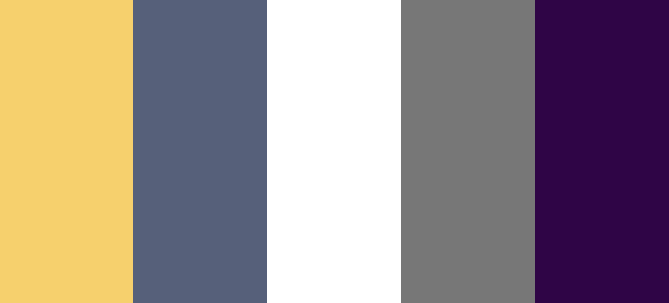

# Make your own unique Honey taste at - Reillys Honey Farm!

## Introduction

From experience passed down for generations, Reillys Honey Farm harness the best honey three
is and now in with a unique idea they now allow you to mix your own variation of honey.
Measured out in Jars through percentages you can now purchase minimum quantities and enjoy at home.

Reillys Honey Farm website aims to provide customers with knowledge about where their honey is
coming from, what flowers provide different tastes, locations of the different hives and test 
their general knowledge on bees as some light hearted fun. 

The website can be viewed on Desktop, Tablet and Mobile devices. Click <a href="#">here</a> to view.

## Table of Contents

1.  [UX](#ux)
    * [Goals](#goals)
        * [Website Goal](#website-goals)
        * [Customer Goals](#customer-goals)
        * [Business Goals](#business-goals)
    * [User Stories](#user-stories)
        * [Awareness](#awareness)
        * [The Potential Customer](#the-potential-customer)
        * [The Business Customer](#the-business-customer)
        * [The UX Design](#the-ux-design)
    * [Design](#design)
        * [Colors](#colors)
        * [Font](#font)            
     * [Wireframes](#wireframes)           
2.  [Features](#features)
    * [Existing Features](#existing-features)
    * [Features left to implement](#features-left-to-implement)
    * [Plans for Future Releases](#plans-for-future-releases)
3.  [Technologies](#technologies)
4.  [Testing](#testing)
5.  [Deployment](#deployment)
6.  [Credits](#credits)
7.  [Disclaimer](#disclaimer)
    
## 1. UX

### Goals

#### Website Goals

The goal of Reillys Honey Farm website is to provide customers with a portal to
be able to purchase their own mix of Honey and from where their honey has come from.

**Target audience is:**

* Honey Lovers
* Bee-Keepers
* Nature enthusiasts
* Small local retailers

#### Customer Goals

* Experience a new idea
* Learn what makes different honey tastes
* Where the bee-hives are located
* Be able to purchase honey they made

#### Business Goals

* Fully functional website
* Ease of navigation
* Customers interactivity
* Enjoyable customer experience
* Awareness of Bees

All goals are addressed through user stories

### User Stories

#### Awareness

**As a Bee-keeping Website I want my website to:**

* be an attractive first impression on opening.
* give an immediate feel to what the website is about.
* display simple navigational technologies.
* have a strong focus on mobile usability.
* have minimal user information stored.
* captivate the user immediately with animated images.
* be usable for both right and left handed users.
* allow users to engage with us through social media channels.

#### The Potential Customer

**As a customer I want:**

* the website to be easy navigational.
* the website to be a fun interactive experience.
* the website to be easy to use especially on mobile devices.
* to be able to receive further information by way of email.
* to learn something new about bees.
* to be able to navigate easily back to the Home page.

#### The Business Customer

**As a business owner I want:**

* see if there is potential for my business to collaborate.
* to navigate around and clearly see locations local to me.
* to explore different flavours that I may want to sell.
* to support local businesses.

#### The UX Designer

**As a UX Designer I want:**

* to track user behaviour to monitor areas that may improve the user experience.
* to make sure the user has good experience on all types of devices.
* to build a user base via emails.
* to potentially work with local businesses.
* to provide easy navigation around the site.

### Design

#### Colors

The following colors have formed the main design of the website:

**List of colors used are:**
* #F7D165 Orange Yellow Crayola
* #555F7B Independence
* #FFFFFF White
* #777777 Sonic Silver
* #2F0147 Russian Violet

The predominant color used for this website was Independence apart from the mainbackground colour of white. 
This was chosen to provide a nice contrast with the various images used and maintain a dominant look and feel.

#### Fonts

The main font used for this website was **Roboto** with **Sans Serif** as a backup font. Apart from the main logo text which was **Roboto Slab** to give
the title matching style to the font style on the main image of the Home page.

Font weights used were:
* 300
* 400
* 600

### Wireframes

With the help of [figma](https://www.figma.com/) I produced mockups of the proposed website starting with a mobile first approach.

Links to the mockups can be found [here](https://www.figma.com/file/B83dqKY1SnY79mZndsN8KZ/Reillys-Honey-Farm?node-id=0%3A1) where you will find the full design 
proposal for each page. I tried my best to adhere to the inital proposal only changing things if seen as an additional improvement to the overall
website.

If you cannot access the mockups via the link above you can view them [here]<!--(https://github.com/Bar-Dev//workspace/Reillys-Honey-Farm-MS2/documentation/wireframes)-->

## 2. Features

### Existing Features

#### Home Page

* **Layout and Style**
    * I want the website to give the user a great first impression the minute they open the page. I feel the choice of image used GIF used 
    on the Home page achieves this. Although the GIF was originally a video I replaced it so as to enhance the user experience and not have them 
    possibly waiting for the video to load on startup. 
    I added a clear paragraph on its own under the image to ensure the user a better feel of what is involved within the website 
    * Any text used was to give clear decisive information about the images it was next too, general information and also for directions on how to use 
    the interactive Honey Jar page. 
    * Careful detail was applied to the responsiveness of the site to further ensure all retail space sized correctly and not leaving any blank areas. A lot 
    of attention was put into this through the use of media queries.

* **Navigation Bar**
    * The navigation bar has a fixed position on all pages to allow for easy constant use. 
    * On small screen widths the navbar items reduce to a toggler icon that provides them with a dropdown list when clicked.
    * The Indepenence color was used on the navbar to keep in touch with the overall theme of the Website, with the addition of a bee logo
    to always give that feel of where you are.
    * The "Sign Up" button on the Navbar allows users to sign up to the website with their email in order to receive a monthly newsletter 
    about any offers that may arise.

* **Footer**
    * Contact information: 
        * For now the contact links have been solely dependant on the social media links. There will be plans in the future to add 
        additional contact information.
    * Social section provides links to all relevant social media sites (currently linked to login pages of each)
    * The Orange Yellow Crayola colour of the social links changes to Russian Violet on hover in order to give the user a sense of what icon they are on..

* **Home**
    * The Home page consists of information about the different hive locations and where they can be found via an interactive map from Google. Once the 
    user hovers over the map markers the location will popup next to it.

* **Progressing**
    * I have then included a button to the bottom of the page as well as the navbar to lead people onto the Honey page. The purpose of this was 
    to provide a better flow through the website.

#### Honey & Quiz

**Honey**
* I wanted the site to be as user friendly as possible as well as always giving the user a sense of what is going on. This is achieved by displaying
the Honey Jar been filled by the required amount selected by the user from each hive location.
* Should they make an error and over-fill the Jar the Jar will then empty and reset ready to be filled again.
**Quiz**
* A Quiz was added to the bottom of the page prior to what will be the "checkout" to give the user a chance of winning a discount on their Honey.
* In addition this also provides the user with some better understanding about bees.

### Features left to implement

* Different Languages - While the website is full of visual information I would still like to be able to implement a list of countries so the website would display 
all text in a language native to that country as international shipping can become an option.
* Checkout - At the moment once the quiz is complete a modal will return you to the Home page. In time this will instead lead onto a checkout page
for purchasing of the Honey. 
* Tracking - I would like to install analytical tools to properly monitor how much traffic the website gets at different times of the year.

### Plans for future releases

* Expansion - I would like to offer up the website to other Bee-Keepers as a way for them to be able to generate business.
* Social Media - The current social media links are only general links to login pages. I want to have relevant information on those links further expanding Reillys Honey Farm business.
* Contact - There will be increased ways for users and businesses to contact us.

## 3. Technologies

### Languages

* HTML - base language for this project.
* CSS - used for styling the HTML code.
* JavaScript - used with Bootstrap for Modals

### Libaries

* [Bootstrap](https://getbootstrap.com/) - used for responsive grid system, styling and modals.
* [FontAwseome](https://fontawesome.com/) - used for all icons on the site.
* [Google Fonts](https://fonts.google.com/) - used for the Pacifico fonts.
* [Favicon.io](https://favicon.io/) - used for creating a favicon.

### Tools

* [Gitpod](https://www.gitpod.io) - used as IDE for this project.
* [Git](https://git-scm.com/) - used for version control.
* [Github](https://github.com/) - used to host repository and live website.
* [Figma](https://www.figma.com/) - used for creation of mockups.
* [Am I Responsive](http://ami.responsivedesign.is/) - used for testing purposes as well as creating the image to display the web pages on different devices.
* [Google Chrome DevTools](https://developers.google.com/web/tools/chrome-devtools) - used for testing and debugging.
* [w3 html validator](https://validator.w3.org/) - used to test and validate my html code.
* [w3 css validator](https://jigsaw.w3.org/) - used to test and validate my css code.
* [Free Formatter](https://www.freeformatter.com/) - used to format my html, css and javascript code.
* [Coolors](http://coolors.co/) - used to test colour combinations.

## 4. Testing

Full documentation of all testing can be viewed [here](https://github.com/Bar-Dev/Reillys-Honey-Farm-MS2/tree/master/testing.md)

## 5. Deployment

A live demo of the website can be reached [here](https://bar-dev.github.io/Reillys-Honey-Farm-MS2)

This web app was developed in Gitpod and pushed to the remote repository, GitHub. The live page is hosted on GitHub Pages. 

**Used commands during deployment:**
* `git add .` - to add the files to the staging area.
* `git commit -m "text message here"` - to commit the files.
* `git push` - to push to origin master branch on to GitHub.
* `git status` - to see the current status of the files.

### Hosting on GitHub Pages

* Log into GitHub.
* From the list of repositories choose [Reillys-Honey-Farm-MS2](https://github.com/Bar-Dev/Reillys-Honey-Farm-MS2).
* Go to settings.
* Scroll down to GitHub Pages section.
* Select as a source **master branch**.
* The page is now automatically refreshed and the project is deployed.
* To access the project scroll down again to GitHub Pages section and click on the provided link.

For more detailed information regarding deployment to GitHub Pages click [here](https://pages.github.com/).

## 6. Credits

### Content

All content in this web app was written by me or code that was altered or acknowledged in this ReadMe.

### Media

**Images**
   * [Blackberry Flowers](https://travelingrainvilles.typepad.com/traveling_home/2011/08/blackberry-bushes.html)
   * [Honey Bee](https://freepngimg.com/png/11204-bee-png-5)
   * [Honey Jars](https://www.slacklist.info/best-honey-jar/)
   * [Honey Map](https://www.google.ie/maps)
   * [Lavender](https://www.almanac.com/plant/lavender)
   * [Rosemary](https://i.ytimg.com/vi/uEULyFD8OdI/hqdefault.jpg)

**Videos**
   * [Bees Gif](https://www.pexels.com/search/videos/bees/)

### Acknowledgements

#### Tutorials

* [Code Institute](https://codeinstitute.net/) - I used a lot of the course content to help me building my site

#### Pages used for information

* [W3schools](https://www.w3schools.com/)
* [W3C](https://www.w3.org/)
* [Stack overflow](https://stackoverflow.com/)
* [CSS-Tricks](https://css-tricks.com/)
* [Bootstrap](https://getbootstrap.com/)
* [Codepen](https://codepen.io/jouanmarcel/pen/RwweKqb)

#### I received advice and encouragement from
   * Seun Owonikoko (Mentor)
   * JimLynx (Slack Webinars and Forum help)
   * Kamil Zok (Slack Forum help)
   * Anthony (Slack Forum Help)
   * Laimo (Slack Forum Help)

## 7. Disclaimer: 
This project is for educational purposes only, no materials/files are intended for any commercial use. 
In this document all sources will be credited.
